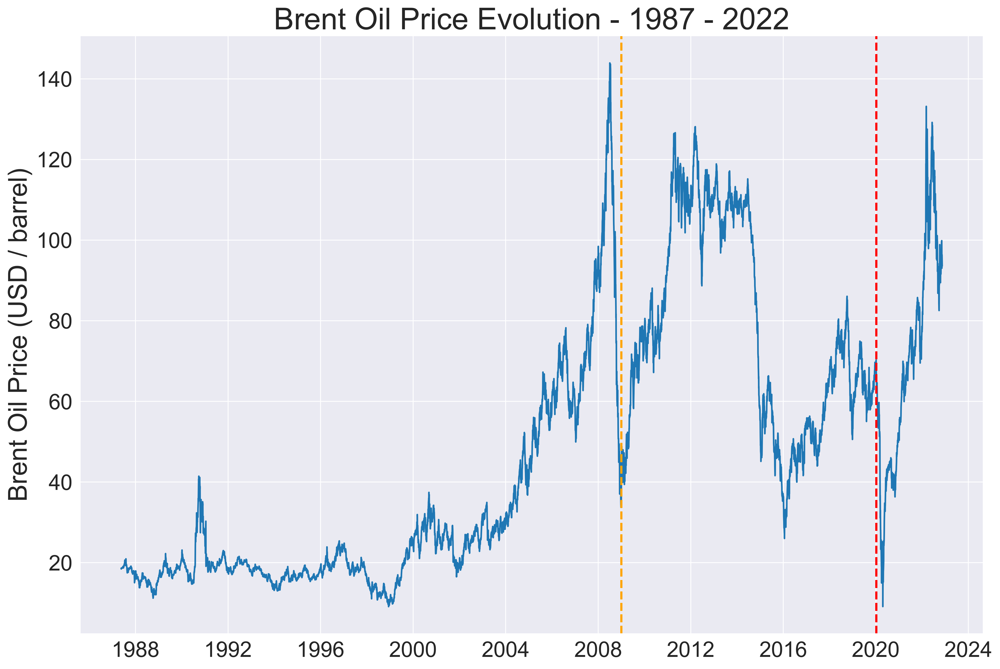

# **Deep Learning Applications for Chemical Engineers**

---

Welcom to this repository ! Here, I'm developing several applications of Deep Learning in Chemical Engineering.

The goals include:

- apply deep learning algorithms to typical chemical and process engineering problems
- to solve business problemas with these tools
- to be a repo for other chemical engineers who are looking for applications and to know more about Data Science
- to practice and strenghten my research writing and thinking skills

## **Use Cases**

###  **1. Brent Oil Dataset - LSTM and Time Series**

In this use case, we explore the application of Recurrent Neural Networks (RNN) to model a typical time series problem: the prediction of the price of a oil barrel.

The main purpose is to check whether a RNN - a LSTM (Long Short-Term Memory Network, more specifically) - is capable of using data of on crisis period (the Oil Shock of 2007-2008) to predict the intense variations in the prices during th COVID-19 global pandemic.

